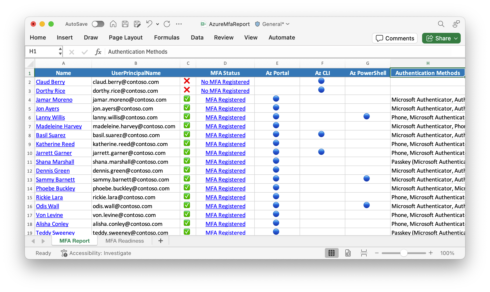

## SYNOPSIS

Exports the list of users that have signed into the Azure portal, Azure CLI, or Azure PowerShell over the last 30 days by querying the sign in logs.
In [Microsoft Entra ID Free](https://learn.microsoft.com/entra/identity/monitoring-health/reference-reports-data-retention#activity-reports) tenants, sign-in log retention is limited to seven days.

The report also includes each user's multi-factor authentication (MFA) registration status from Microsoft Entra.

```powershell
Install-Module MsIdentityTools -Scope CurrentUser
Connect-MgGraph -Scopes Directory.Read.All, AuditLog.Read.All, UserAuthenticationMethod.Read.All
Export-MsIdAzureMfaReport .\report.xlsx
```

### Permissions and roles

- Required Microsoft Entra role: **Global Reader**
- Required permission scopes: **Directory.Read.All**, **AuditLog.Read.All**, **UserAuthenticationMethod.Read.All**


*This report will assist you in assessing the impact of the [Microsoft will require MFA for all Azure users](https://techcommunity.microsoft.com/t5/core-infrastructure-and-security/microsoft-will-require-mfa-for-all-azure-users/ba-p/4140391) rollout on your tenant.*



## SYNTAX

```powershell
Export-MsIdAzureMfaReport [[-ExcelWorkbookPath] <String>] [-PassThru] [-Days <Int32>] [-Users <Array>]
 [-UsersMfa <Array>] [-UseAuthenticationMethodEndPoint] [-ProgressAction <ActionPreference>]
 [<CommonParameters>]
```

## DESCRIPTION

### Consenting to permissions
    If this is the first time running `Connect-MgGraph` with the permission scopes listed above, the user consenting to the permissions will need to be in one of the following roles:
    - **Cloud Application Administrator**
    - **Application Administrator**
    - **Privileged Role Administrator**

    After the initial consent the `Export-MsIdAzureMfaReport` cmdlet can be run by any user with the Microsoft Entra **Global Reader** role.

### Third party multi-factor authentication

    The `MFA status` in this report is based on authentication methods registered by the user in Microsoft Entra.
The `MFA status` is not applicable if your tenant uses a third party multi-factor authentication provider (including [Custom Controls](https://learn.microsoft.com/entra/identity/conditional-access/controls)).

### PowerShell 7.0

    This cmdlet requires [PowerShell 7.0](https://learn.microsoft.com/powershell/scripting/install/installing-powershell) or later.

## EXAMPLES

### EXAMPLE 1

```powershell
Install-Module MsIdentityTools -Scope CurrentUser
Connect-MgGraph -Scopes Directory.Read.All, AuditLog.Read.All, UserAuthenticationMethod.Read.All
Export-MsIdAzureMfaReport .\report.xlsx
```

Queries last 30 days (7 days for Free tenants) sign in logs and outputs a report of users accessing Azure and their MFA status in Excel format.

### EXAMPLE 2

```powershell
Export-MsIdAzureMfaReport .\report.xlsx -Days 3
```

Queries sign in logs for the past 3 days and outputs a report of Azure users and their MFA status in Excel format.

### EXAMPLE 3

```powershell
Export-MsIdAzureMfaReport -PassThru | Export-Csv -Path .\report.csv
```

Returns the results and exports them to a CSV file.

## PARAMETERS

### -ExcelWorkbookPath

Output file location for Excel Workbook.
e.g.
.\report.xlsx

```yaml
Type: String
Parameter Sets: (All)
Aliases:

Required: False
Position: 2
Default value: None
Accept pipeline input: False
Accept wildcard characters: False
```

### -PassThru

Switch to include the results in the output

```yaml
Type: SwitchParameter
Parameter Sets: (All)
Aliases:

Required: False
Position: Named
Default value: False
Accept pipeline input: False
Accept wildcard characters: False
```

### -Days

Number of days to query sign in logs.
Defaults to 30 days for premium tenants and 7 days for free tenants

```yaml
Type: Int32
Parameter Sets: (All)
Aliases:

Required: False
Position: Named
Default value: 0
Accept pipeline input: False
Accept wildcard characters: False
```

### -Users

Optional.
Hashtable with a pre-defined list of User objects (Use Get-MsIdAzureUsers).

```yaml
Type: Array
Parameter Sets: (All)
Aliases:

Required: False
Position: Named
Default value: None
Accept pipeline input: False
Accept wildcard characters: False
```

### -UsersMfa

Optional.
Hashtable with a pre-defined list of User objects with auth methods.
Used for generating spreadhsheet.

```yaml
Type: Array
Parameter Sets: (All)
Aliases:

Required: False
Position: Named
Default value: None
Accept pipeline input: False
Accept wildcard characters: False
```

### -UseAuthenticationMethodEndPoint

If enabled, the user auth method will be used (slower) instead of the reporting API.
This is the default for free tenants as the reporting API requires a premium license.

```yaml
Type: SwitchParameter
Parameter Sets: (All)
Aliases:

Required: False
Position: Named
Default value: False
Accept pipeline input: False
Accept wildcard characters: False
```

### -ProgressAction

\{\{ Fill ProgressAction Description \}\}

```yaml
Type: ActionPreference
Parameter Sets: (All)
Aliases: proga

Required: False
Position: Named
Default value: None
Accept pipeline input: False
Accept wildcard characters: False
```

### CommonParameters

This cmdlet supports the common parameters: -Debug, -ErrorAction, -ErrorVariable, -InformationAction, -InformationVariable, -OutVariable, -OutBuffer, -PipelineVariable, -Verbose, -WarningAction, and -WarningVariable. For more information, see [about_CommonParameters](http://go.microsoft.com/fwlink/?LinkID=113216).

## INPUTS

## OUTPUTS

## NOTES

## RELATED LINKS
