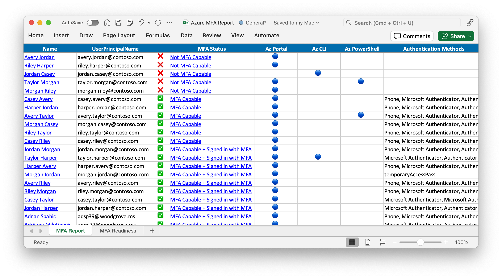

## SYNOPSIS

Exports the list of users that have signed into the Azure portal, Azure CLI, or Azure PowerShell over the last 30 days by querying the sign-in logs.
In [Microsoft Entra ID Free](https://learn.microsoft.com/entra/identity/monitoring-health/reference-reports-data-retention#activity-reports) tenants, sign-in log retention is limited to seven days.

The report also includes each user's multi-factor authentication (MFA) registration status from Microsoft Entra.

```powershell
Install-Module MsIdentityTools -Scope CurrentUser

Connect-MgGraph -Scopes Directory.Read.All, AuditLog.Read.All, UserAuthenticationMethod.Read.All

Export-MsIdAzureMfaReport .\report.xlsx
```

### Permissions and roles

- Required Microsoft Entra role: **Global Reader**
- Required permission scopes: **Directory.Read.All**, **AuditLog.Read.All**, **UserAuthenticationMethod.Read.All**

### Output



* This report will assist you in assessing the impact of the [Microsoft will require MFA for all Azure users](https://techcommunity.microsoft.com/t5/core-infrastructure-and-security/microsoft-will-require-mfa-for-all-azure-users/ba-p/4140391) rollout on your tenant.
### MFA Status

- **✅ MFA Capable + Signed in with MFA**: The user has MFA authentication methods registered and has successfully signed in at least once to Azure using MFA.
- **✅ MFA Capable**: The user has MFA authentication methods registered but has always signed into Azure using single factor authentication.
- **❌ Not MFA Capable**: The user has not yet registered a multi-factor authentication method and has not signed into Azure using MFA.
Note: This status may not be accurate if your tenant uses identity federation or a third-party multi-factor authentication provider.
See [MFA Status when using identity federation](#mfa-status-when-using-identity-federation).

## SYNTAX

```powershell
Export-MsIdAzureMfaReport [[-ExcelWorkbookPath] <String>] [-SignInsJsonPath <String>] [-PassThru]
 [-Days <Int32>] [-Users <Array>] [-UseAuthenticationMethodEndPoint] [-ProgressAction <ActionPreference>]
 [<CommonParameters>]
```

## DESCRIPTION

### Consenting to permissions
    If this is the first time running `Connect-MgGraph` with the permission scopes listed above, the user consenting to the permissions will need to be in one of the following roles:
    - **Cloud Application Administrator**
    - **Application Administrator**
    - **Privileged Role Administrator**

    After the initial consent the `Export-MsIdAzureMfaReport` cmdlet can be run by any user with the Microsoft Entra **Global Reader** role.

### PowerShell 7.0

    This cmdlet requires [PowerShell 7.0](https://learn.microsoft.com/powershell/scripting/install/installing-powershell) or later.

## EXAMPLES

### EXAMPLE 1

```powershell
Connect-MgGraph -Scopes Directory.Read.All, AuditLog.Read.All, UserAuthenticationMethod.Read.All
Export-MsIdAzureMfaReport .\report.xlsx
```

Queries the last 30 days sign-in logs and creates a report of users accessing Azure and their MFA status in Excel format.

### EXAMPLE 2

```powershell
Export-MsIdAzureMfaReport .\report.xlsx -Days 3
```

Queries sign-in logs for the past 3 days and creates a report of Azure users and their MFA status in Excel format.

### EXAMPLE 3

```powershell
Export-MsIdAzureMfaReport -PassThru | Export-Csv -Path .\report.csv
```

Returns the results and exports them to a CSV file.

### EXAMPLE 4

```powershell
Export-MsIdAzureMfaReport .\report.xlsx -SignInsJsonPath ./signIns.json
```

Generates the report from the sign-ins JSON file downloaded from the Entra portal.
This is required for Entra ID Free tenants.

## PARAMETERS

### -ExcelWorkbookPath

Output file location for Excel Workbook.
e.g.
.\report.xlsx

```yaml
Type: String
Parameter Sets: (All)
Aliases:

Required: False
Position: 2
Default value: None
Accept pipeline input: False
Accept wildcard characters: False
```

### -SignInsJsonPath

Optional.
Path to the sign-ins JSON file.
If provided, the report will be generated from this file instead of querying the sign-ins.

```yaml
Type: String
Parameter Sets: (All)
Aliases:

Required: False
Position: Named
Default value: None
Accept pipeline input: False
Accept wildcard characters: False
```

### -PassThru

Switch to include the results in the output

```yaml
Type: SwitchParameter
Parameter Sets: (All)
Aliases:

Required: False
Position: Named
Default value: False
Accept pipeline input: False
Accept wildcard characters: False
```

### -Days

Optional.
Number of days to query sign-in logs.
Defaults to 30 days.

```yaml
Type: Int32
Parameter Sets: (All)
Aliases:

Required: False
Position: Named
Default value: 0
Accept pipeline input: False
Accept wildcard characters: False
```

### -Users

Optional.
Hashtable with a pre-defined list of User objects (Use Get-MsIdAzureUsers).

```yaml
Type: Array
Parameter Sets: (All)
Aliases:

Required: False
Position: Named
Default value: None
Accept pipeline input: False
Accept wildcard characters: False
```

### -UseAuthenticationMethodEndPoint

If enabled, the user auth method will be used (slower) instead of the reporting API.
This is the default for free tenants as the reporting API requires a premium license.
[array]
$UsersMfa, # Used for dev.
Hashtable with a pre-defined list of User objects with auth methods.
Used for generating spreadhsheet.

```yaml
Type: SwitchParameter
Parameter Sets: (All)
Aliases:

Required: False
Position: Named
Default value: False
Accept pipeline input: False
Accept wildcard characters: False
```

### -ProgressAction

\{\{ Fill ProgressAction Description \}\}

```yaml
Type: ActionPreference
Parameter Sets: (All)
Aliases: proga

Required: False
Position: Named
Default value: None
Accept pipeline input: False
Accept wildcard characters: False
```

### CommonParameters

This cmdlet supports the common parameters: -Debug, -ErrorAction, -ErrorVariable, -InformationAction, -InformationVariable, -OutVariable, -OutBuffer, -PipelineVariable, -Verbose, -WarningAction, and -WarningVariable. For more information, see [about_CommonParameters](http://go.microsoft.com/fwlink/?LinkID=113216).

## INPUTS

## OUTPUTS

## NOTES

### Entra ID Free tenants

If you are using an Entra ID Free tenant, additional steps are required to download the sign-in logs

Follow these steps to download the sign-in logs.

- Sign-in to the **[Entra Admin Portal](https://entra.microsoft.com)**
- From the left navigation select: **Identity** → **Monitoring & health** → **Sign-in logs**.
- Select the **Date** filter and set to **Last 7 days**
- Select **Add filters** → **Application**
- Type in: **Azure** and click **Apply**
- Select **Download** → **Download JSON**
- Set the **File Name** of the first textbox to **signins** and click **Download**.
- Once the file is downloaded, copy it to the folder where the export command will be run.

Run the export with the **-SignInsJsonPath** option.
```powershell
Export-MsIdAzureMfaReport ./report.xlsx -SignInsJsonPath ./signins.json
```

### Delay in reporting MFA Status and Authentication Methods

The **MFA Status** does not immediately reflect changes made to the user's authentication methods.
Expect a delay of up to 24 hours for the report to reflect the latest MFA status.

To get the latest MFA status use the `-UseAuthenticationMethodEndPoint` switch.
This option will get the latest user details but will take longer to export.

### MFA Status when using identity federation

Tenants configured with identity federation may not have an accurate **MFA Status** in this report unless MFA is enforced for Azure Portal access.

To resolve this:

- Enforce MFA for these users using Conditional Access or Security Defaults.
  - [Conditional Access policy - Require MFA for Azure management](https://learn.microsoft.com/entra/identity/conditional-access/howto-conditional-access-policy-azure-management) for Entra ID premium tenants.
  - [Security Defaults](https://learn.microsoft.com/entra/fundamentals/security-defaults) for Entra ID free tenants.
- Request users to sign in to the Azure portal.
- Re-run this report to confirm their MFA status.

## RELATED LINKS
